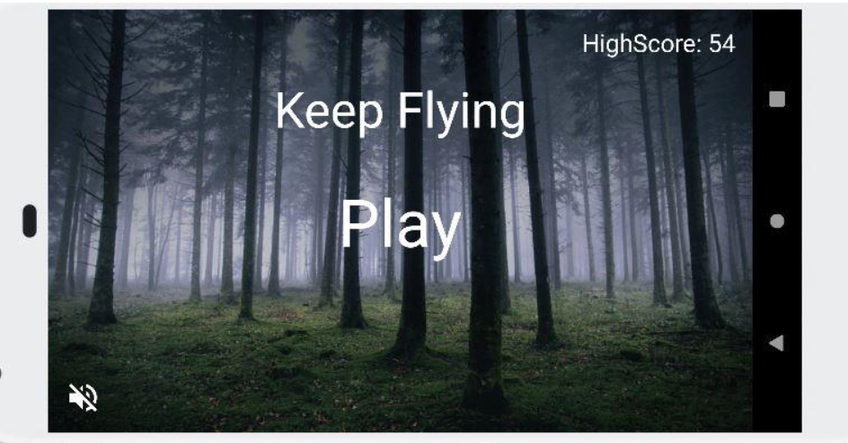
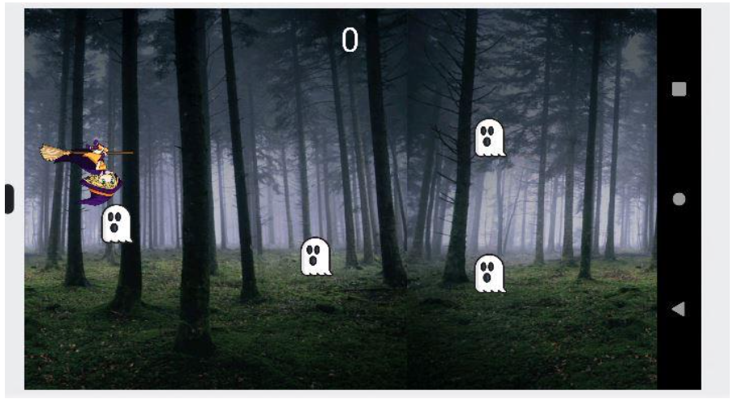

# mobile-squidgamedevops
mobile-squidgamedevops created by GitHub Classroom
                  
                 <h1> __SquidGameTeam__ </h1>
                  
                 <h2> __Keep flying__ : </h2>
           
         
       
     
 Pour commencer le jeu appuyer sur Play
     Votre meilleur score s’affichera en haut à droite
     Vous avez aussi la possibilité de couper le son du jeu en bas à gauche 

         
        
         
    
 Le principe est simple vous devez éliminer le plus de fantômes grâce au sortilège de la sorcière Pour voler appuyer 
     à gauche de l’écran et pour jeter un sort appuyer sur la droite
     A chaque fantôme éliminer vous gagner 1 point mais attention à ne pas laisser passer un fantôme car vous mourrez immédiatement !

       
     BON JEUX !!!!
